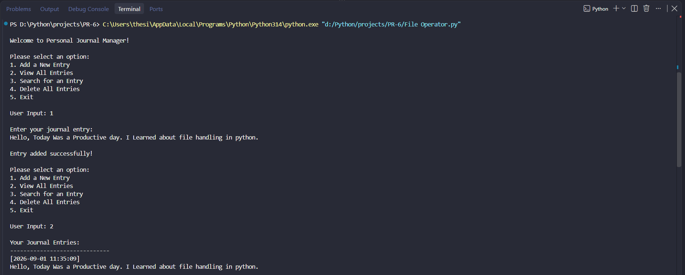
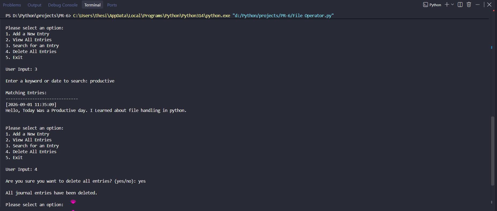
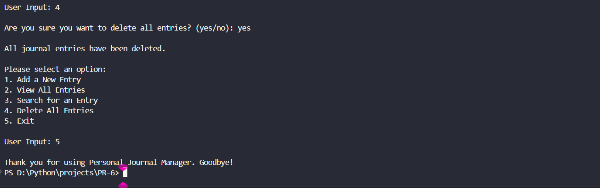
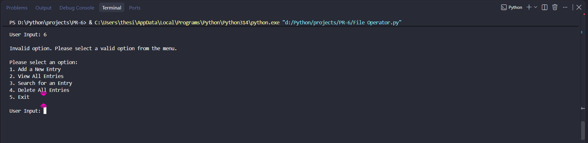
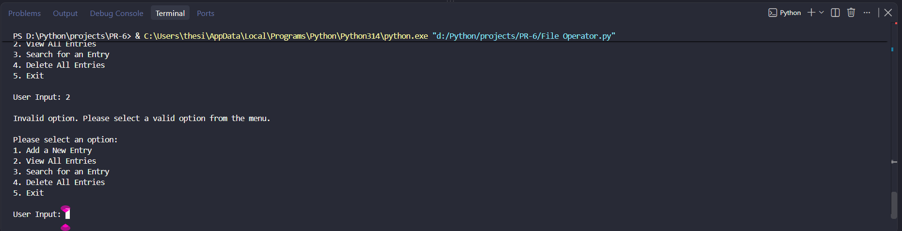

# File Operator

## 📌 Project Description

This project is a simple **File Operator** program developed using Python.

The main purpose of this project is to practice file handling operations in Python.

## 🚀 Features

- Add a new journal entry
- View all journal entries
- Search for an entry
- Delete all journal entries
- Handle file-related errors

## 📸 Screenshots

### Screenshot 1

### Screenshot 2

### Screenshot 3

### Screenshot 4

### Screenshot 5
